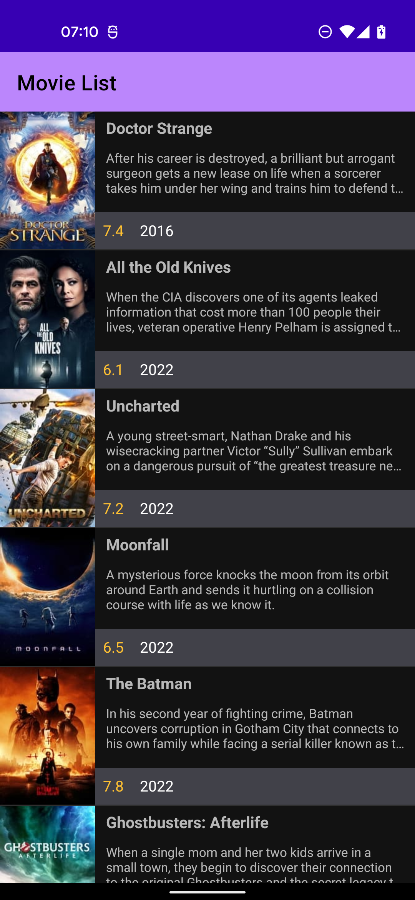
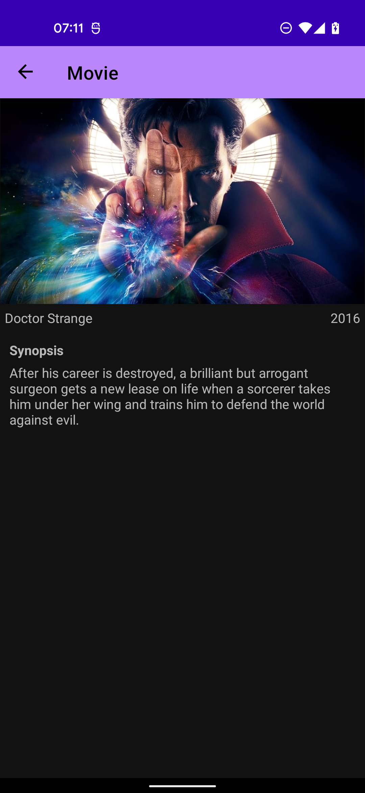
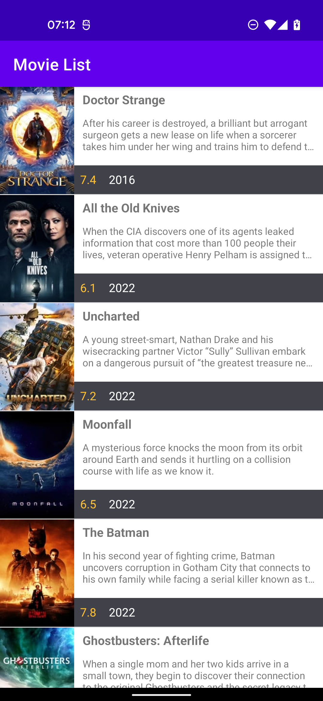
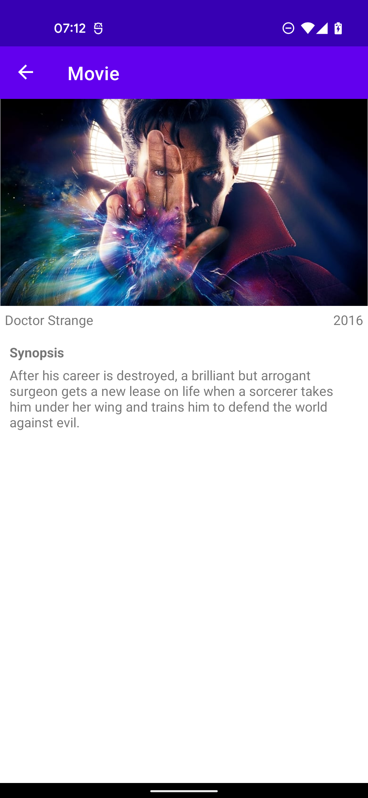

# Movies IO App
Fun movie app for staying up to date with your favourite movies.

## Screenshots 📱

### Dark Mode
| Movies Page | Detail Page |
| --- | --- |
|  | 
### Light Mode
| Movies Page  | Detail Page |
| --- | --- |
|  | 

## Prerequisites 🔩
- Android min sdk 21 (Android 5.0)
- Java 11 (to run tests from command line)
- This application uses the [`TMDB` api](https://www.themoviedb.org/documentation/api) to provide movie information.

## Getting Started
Clone the repo with `git clone git@github.com:TobiAlbert/Moviesio.git`

In the root folder, create a `credentials.properties` file and add your `TMDB` API Key.
```text
API_KEY="your-tmdb-api-key"
```

## Libraries/Technologies Used 🛠
- Hilt
- Coroutines
- Retrofit
- Coil (for Image loading)
- Room
- Paging Library
- Chucker
- Espresso
- Truth (by Google)
- Jetpack Navigation

## TODO 📝 🚧
- Update Coroutines Testing Library
- Migrate to Jetpack Compose